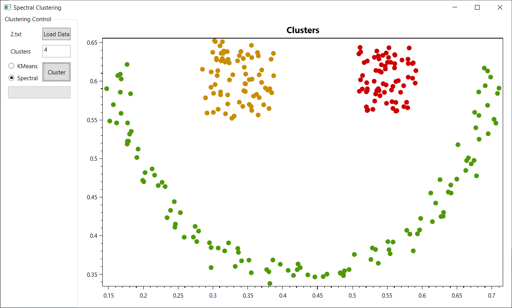

# Clustering

A Visual Studio solution for playing around with C++/Cli wrappers for native C++. Using spectral clustering code from
[Spectral Clustering code](https://github.com/pthimon/clustering). Using test data from [IoSL_Clustering](https://github.com/atidjani/IoSL_Clustering/wiki/self-tuning-spectral-clustering)

Consists of 4 projects

## Spectral Clustering
Copy of the [C++ code](https://github.com/pthimon/clustering). Currently using version 3.2 the [Eigen library](eigen.tuxfamily.org) set to Eigen version 2 support.

## Clustering
A C++/Cli Wrapper

## ClusteringApp
A rudimentry C# WPF app using [Prism](https://github.com/PrismLibrary/Prism) and [OxyPlot](https://github.com/oxyplot/oxyplot) for charting the data and results.
Currently only loads txt or csv files that are simply two columns of normalised coordinates.

## SpectralClustering_Test
A GoogleTest project, not currently being used.

## Build
All the above done in Visual Studio 2019. Have to manually link to the Eigen library.

